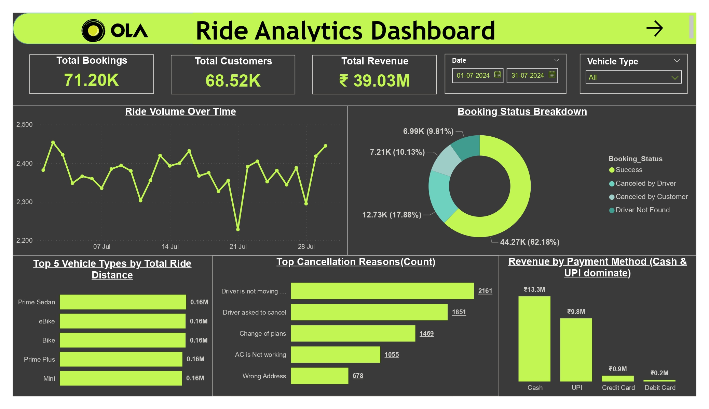
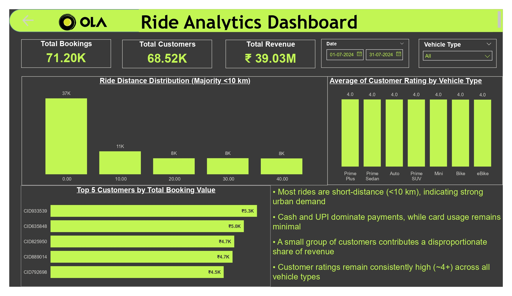

# Ola Ride Analytics Dashboard | End-to-End Power BI Project

## 📊 Overview

This project presents an end-to-end Power BI dashboard analyzing ride booking data to uncover operational trends, customer behavior, and revenue patterns. The objective is to generate actionable insights that help improve service efficiency and customer experience.

---

## 📊 Dashboard Preview

---
## 🛠️ Tech Stack
* SQL → Data cleaning, querying, and transformation
* Power BI → Data modeling & dashboard creation
* Excel / CSV → Raw dataset
* DAX → KPIs and calculated measures

## 🔑 Key Insights

* Majority of rides are short-distance (<10 km), indicating strong urban demand
* Cash and UPI dominate payment methods, while card usage remains minimal
* A small group of customers contributes disproportionately to total revenue
* Customer ratings remain consistently high (~4+) across all vehicle types
* Positive correlation observed between customer and driver ratings

---

## 💡 Business Impact

* Supports urban ride optimization by identifying high-demand distance segments
* Enables better payment strategy decisions based on dominant payment methods
* Helps target high-value customers for retention and loyalty programs
* Confirms service quality consistency through strong rating patterns

---

## 📌 Key Features
### 📈 Ride Volume Trends – Daily booking patterns
### 🚗 Vehicle Type Analysis – Usage and distance distribution
### 💰 Revenue Insights – Payment method breakdown
### ❌ Cancellation Analysis – Key reasons for ride cancellations
### ⭐ Customer & Driver Ratings – Correlation analysis
### 📊 Interactive Filters – Date & vehicle-level slicing
---

## 🛠 Tools & Skills

* Power BI
* DAX (Measures & KPIs)
* Data Modeling
* Data Visualization
* Business Analysis
* SQl
* Excel

---

## 📁 Files Included

* `Ola_RideAnalytics.pbit` – Power BI template
* `Bookings.csv` – Dataset
* Dashboard screenshots

---

## 🚀 How to Use

1. Download the `.pbit` file
2. Open in Power BI Desktop
3. Load dataset when prompted
4. Explore dashboard interactively

---

## 📌 Author

**Sanjay P Nambiar**
Aspiring Data Analyst
